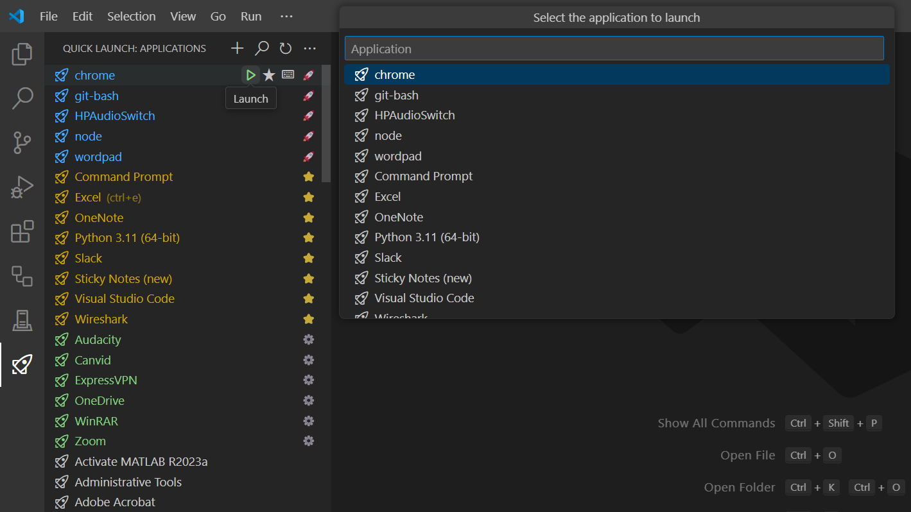

# Quick Launch

Quickly launch any Windows, MacOS, or Linux application right from VS Code! Assign favorites and keyboard shortcuts to access your most commonly used applications with ease.

* 🚀 **Launch Applications**: Launch any application on your machine from VS Code.
* ⚙️ **Add Custom Applications**: Add individual custom applications that are not found in the application directories.
* 🌟 **Assign Favorites**: Assign favorites to easily find your most commonly used applications.
* ⌨️ **Assign Keyboard Shortcuts**: Assign keyboard shortcuts to individual applications to quickly launch them.
* ✏️ **Configure Application Directories & Extensions**: Configure the directories and extensions that will be used to search for applications.

## Getting Started

1. To launch any application, you have 3 options:
    * Click `Launch` on an application.
    * Click `Search for Applications` to browse.
    * Use `Launch Application` from the command palette to also browse.
2. To add custom applications, click `Add...` > `Custom Applications`. These will be denoted in green with a ⚙️ badge.
3. To assign favorites, click `Favorite` on an application. These will be denoted in yellow with a ⭐ badge or even blue with a 🚀 badge if they are also custom applications.
4. To assign keyboard shortcuts, click `Assign Keyboard Shortcut` on an application.
5. To configure application directories or extensions click `Add...` > `Application Directories` or `Application Extensions`.

## Extension Settings

Listed below are all the extension settings which can be configured from using the extension or directly through the VS Code settings page by searching `@ext:SanjulaGanepola.quick-launch`:

| **Setting**                         | **Description**                                               |
|-------------------------------------|---------------------------------------------------------------|
| `QuickLaunch.applicationDirectories`| The directories to search for applications.                   |
| `QuickLaunch.applicationExtensions` | The possible file extensions for applications.                |
| `QuickLaunch.customApplications`    | A user-maintained set of custom applications.                 |
| `QuickLaunch.favoriteApplications`  | The names of your favorite applications.                      |
| `QuickLaunch.sort`                  | Controls what order the applications are sorted in. <ul><li>**Priority**: Applications are sorted based on priority. Favorite applications are rendered first, followed by custom applications, and lastly other applications. Applications which are both favorites and custom will take the highest position in the list.</li><li>**Alphabetically**: Applications are sorted alphabetically by name.</li></ul> |
| `QuickLaunch.view`                  | Controls which applications are displayed. <ul><li>**Favorites**: Display favorite applications.</li><li>**Customs**: Display custom applications.</li><li>**Other**: Display other applications.</li></ul> |

## Bugs and Feature Requests

Feel free to share any bugs or feature requests in the project's [GitHub Issues](https://github.com/SanjulaGanepola/quick-launch/issues) page.

## Contribution

Contributions are always welcome! Please see our contributing guide for more details.

## Maintainers

* [@SanjulaGanepola](https://github.com/SanjulaGanepola)